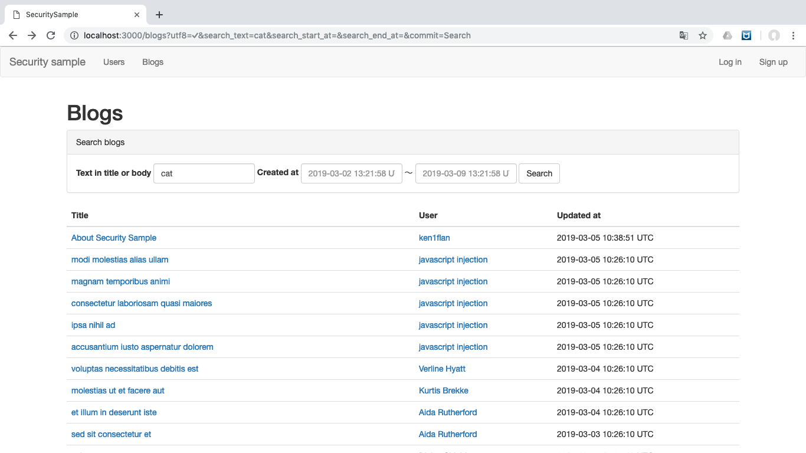
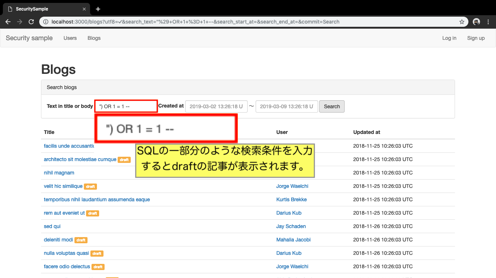

# SQLのスキでヤラれる


ここでは、SQLインジェクションについて簡単に説明したあと、実際に試し、どのような原因で起きているのかを見たあとに、修正方法について検討します。

## SQLインジェクションとは？

SQLインジェクションは、攻撃者が入力した値によって、製作者が意図しないSQLを生成し、不正にデータベースの内容を読み取ったり、改ざんを行ったりすることです。

## SQLインジェクションを試す

それでは実際に試してみましょう。
サンプルアプリケーションで準備しているのは、ブログの検索の機能です。

http://localhost:3000/blogs

### ブログ一覧の機能

このページは、登録されているブログをキーワードなどで検索できる機能があります。
検索ワードに`cat`などの任意のキーワードを入れて、`Search`ボタンを押すと、そのキーワードが含まれるブログが表示されます。

ブログには`draft`、いわゆる下書きという状態があり、この状態のときには他のユーザには見えないようになっています。
なので、検索しても`draft`の記事は出てきません。



### 特殊なキーワードで検索

テキスト検索のところに `") OR 1 = 1 --` を入れて Search ボタンを押します。

そうすると、本来見えないはずの`draft`のバッジのついたブログが一覧に表示されます。



これはどういうことでしょうか。

## SQLインジェクション脆弱性の作り方

ブログ一覧と検索を処理している`BlogController#index`を見てみます。

```ruby
class BlogsController < ApplicationController
  def index
    @blogs = Blog.includes(:user).published.order("updated_at DESC")

    @search_text = params[:search_text]
    @search_start_at = params[:search_start_at]
    @search_end_at = params[:search_end_at]

    if @search_text.present?
      @blogs = @blogs.where("title LIKE \"%#{@search_text}%\" OR body LIKE \"%#{@search_text}%\"")
    end
      :
      :
  end
```

`@blogs = @blogs.where("title LIKE \"%#{@search_text}%\" OR body LIKE \"%#{@search_text}%\"")`ですが、検索キーワードが指定されたときに、直接SQLに埋め込んでWHERE句を作成しています。

これによって内部で生成されるSQLは次のようになり、概ね期待通りの動作になります。

```SQL
SELECT "blogs".* FROM "blogs" WHERE "blogs"."status" = ? AND (title LIKE "%cat%" OR body LIKE "%cat%") ORDER BY updated_at DESC  [["status", 1]]
```

同様にして`") OR 1 = 1 --`で検索したときにどのようなSQLになるのか確認します。

```sql
SELECT "blogs".* FROM "blogs" WHERE "blogs"."status" = ? AND (title LIKE "%") OR 1 = 1 -- %" OR body LIKE "%") OR 1 = 1 -- %") ORDER BY updated_at DESC
```

`1=1`という絶対成立する条件がORで足され、その後ろの部分がコメントアウトされてしまっています。システムに保存されているすべてのデータが表示されてしまいました。

## 直し方

多くのフレームワークやライブラリには、プレースホルダという機能が提供されており、Railsでも利用できますので、それを使います。

```ruby
@blogs = @blogs.where("title LIKE :search_text OR body LIKE :search_text", search_text: "%#{@search_text}%")
```

このように変更したあとに、`") OR 1 = 1 --"`で検索してみると…。

```sql
SELECT "blogs".* FROM "blogs" WHERE "blogs"."status" = ? AND (title LIKE '%") OR 1 = 1 -- %' OR body LIKE '%") OR 1 = 1 -- %') ORDER BY updated_at DESC
```

キーワード検索部分のWHEREが変わり、LIKEの部分が`'`で囲まれるようになったので、キーワードに含めた文字列を終わらせるための `"` が有効にならず、普通の検索になっています。

攻撃者は `"`を`'`に変えて試すでしょう。

```sql
SELECT "blogs".* FROM "blogs" WHERE "blogs"."status" = ? AND (title LIKE '%'') OR 1 = 1 -- %' OR body LIKE '%'') OR 1 = 1 -- %') ORDER BY updated_at DESC
```

修正では特別なことをせずに、プレースホルダを使っただけでしたが、キーワードに仕込んだ`'`がエスケープされて`''`になっています。

プレースホルダーを使えば、フレームワークで問題が出ないように埋め込んでもらうことができました。

もし、項目名に指定のテキストを設定したいなど、プレースホルダで対応できないときには、SQLインジェクションに対する脆弱性の可能性があることを思い出して、十分にサニタイズしてください。
