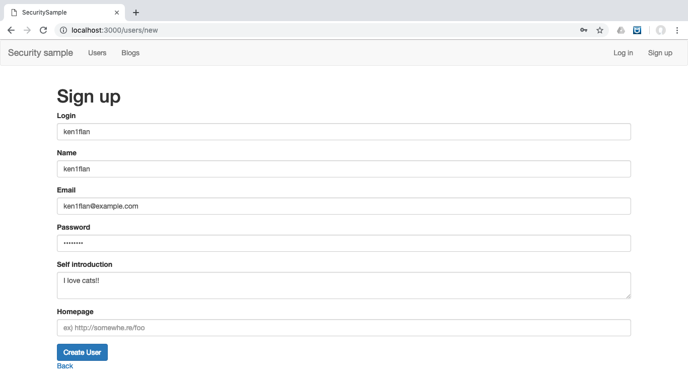

# サンプルアプリケーションとセットアップ

ここでは、この本の中で使うアプリケーションについて、簡単な説明と、セットアップ方法、よく使う操作について説明します。

## サンプルアプリケーション

この本で、セキュリティホールへの攻撃を試すために使うアプリケーションです。
機能的にはブログを管理するもので、主な機能として、次のことができます。

* ユーザ管理（一覧、作成、編集）
* セッション管理（ログイン、ログアウト）
* ブログの管理（一覧/検索、作成、編集、削除）
* リダイレクター
* サービスの管理
  * リダイレクターのログ閲覧

なお、このサンプルアプリケーションはgithubで管理しています。
https://github.com/ken1flan/security_sample

## 事前に準備が必要なもの

次のものは、すでに利用できる想定しています。
利用している環境に合わせて準備してください。

* git
* ruby
* sqlite

## セットアップ

リポジトリをクローンします。

```bash
$ git clone git@github.com:ken1flan/security_sample.git
Cloning into 'security_sample'...
remote: Enumerating objects: 556, done.
remote: Total 556 (delta 0), reused 0 (delta 0), pack-reused 556
Receiving objects: 100% (556/556), 311.77 KiB | 0 bytes/s, done.
Resolving deltas: 100% (276/276), done.
Checking connectivity... done.
$
```

セットアップスクリプトを実行します。

```bash
$ cd security_sample/
$ bin/setup
$ bin/setup
== Installing dependencies ==
The Gemfile's dependencies are satisfied

== Preparing database ==
Created database 'db/development.sqlite3'
Created database 'db/test.sqlite3'
-- create_table("blogs", {:force=>:cascade})
   -> 0.0079s
-- create_table("measurement_tags", {:force=>:cascade})
   -> 0.0124s
-- create_table("sessions", {:force=>:cascade})
   -> 0.0267s
-- create_table("users", {:force=>:cascade})
   -> 0.0049s
-- create_table("blogs", {:force=>:cascade})
   -> 0.0062s
-- create_table("measurement_tags", {:force=>:cascade})
   -> 0.0119s
-- create_table("sessions", {:force=>:cascade})
   -> 0.0179s
-- create_table("users", {:force=>:cascade})
   -> 0.0045s

== Removing old logs and tempfiles ==

== Restarting application server ==
$
```

### 起動

起動はよくあるRailsアプリケーションと同様に、`rails s`です。

```bash
$ rails s
=> Booting Puma
=> Rails 5.1.6 application starting in development
=> Run `rails server -h` for more startup options
Puma starting in single mode...
* Version 3.11.4 (ruby 2.5.1-p57), codename: Love Song
* Min threads: 5, max threads: 5
* Environment: development
* Listening on tcp://0.0.0.0:3000
Use Ctrl-C to stop
```

### ユーザ登録

サンプルアプリケーションで脆弱性を試すときに被害者になってもらうためのユーザを登録しておきます。
ブラウザで http://localhost:3000/users/new を開き、ユーザ登録を行います。



### ログイン
ブラウザで http://localhost:3000/session/new にアクセスします。


ログインIDとパスワードを入れて、「Log in」ボタンを押します。

### ブログ作成

ログインした状態で、画面右上の「New blog」をクリックすると、ブログを作成できます。


### ログアウト

ログインした状態で、画面右上のアカウント名をクリックしてドロップダウンメニューを開き、「Log out」をクリックすると、ログアウトします。


