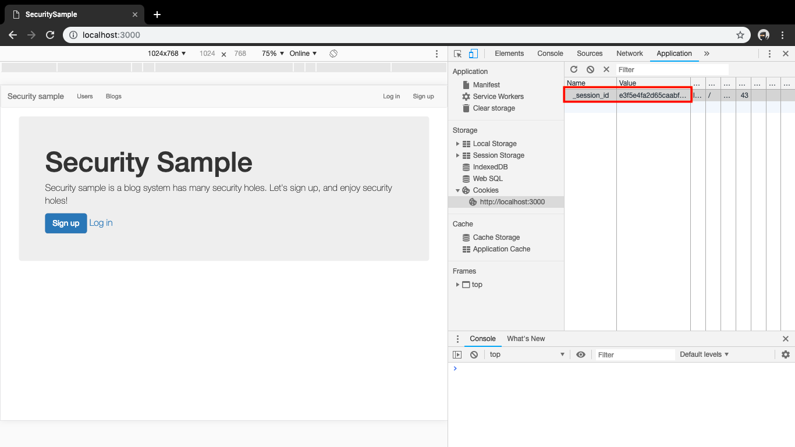
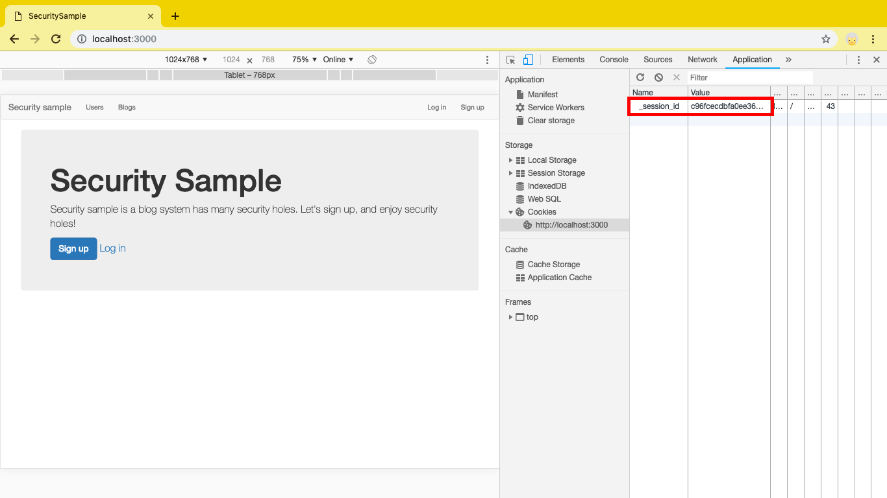
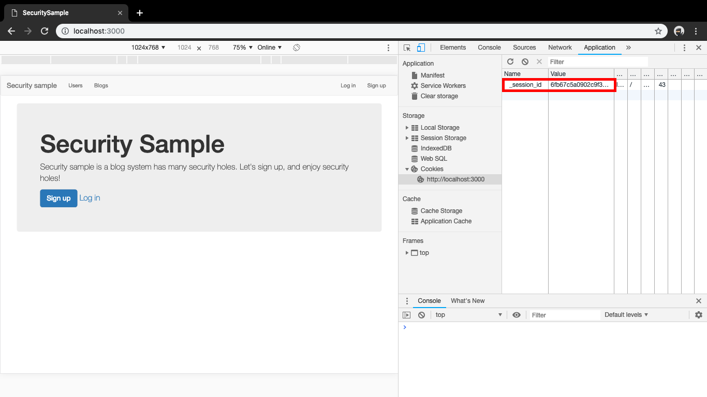
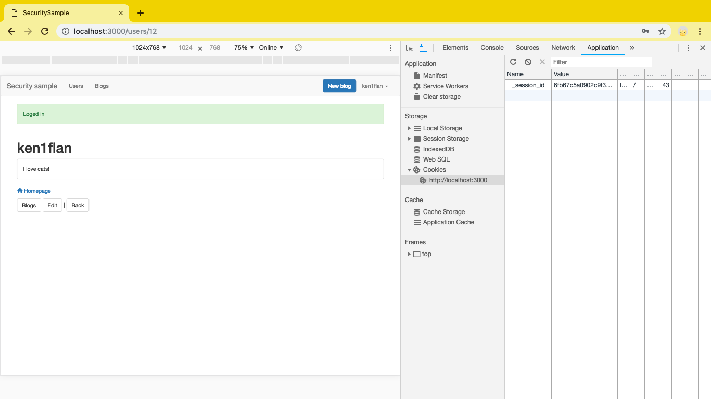
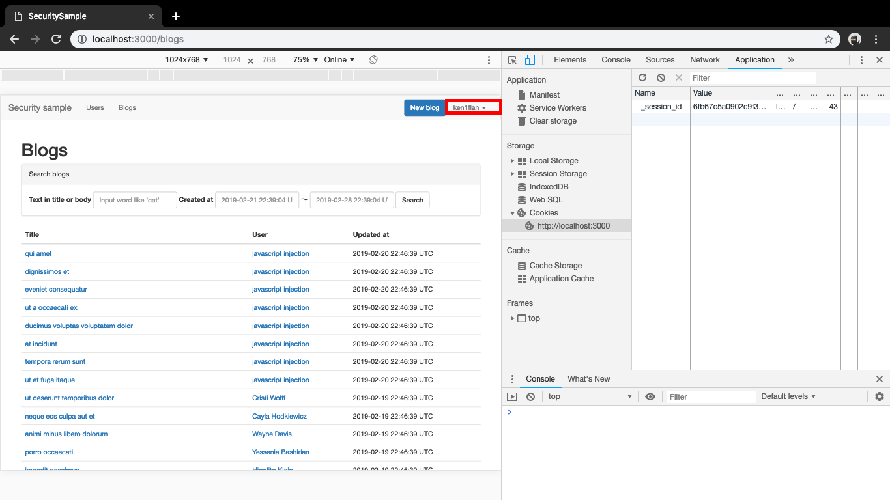

# セッションのスキでヤラれる

ここでは、簡単にセッションの仕組を説明して、その仕組を悪用したセッションハイジャックとセッション固定化を試してみます。
最後に、セッションハイジャックやセッション固定化攻撃を受けにくくする対策について書きます。

## セッション

HTTPは一回一回で接続が切れる、状態を持たないプロトコルですが、
多くのアプリケーションでは、便利な機能を提供するためにユーザの状態を覚えておきたい、という要求があります。
そこで、アプリケーションはユーザに特別な識別番号を配布し、次回アクセス時に提示してもらうことで、同一ユーザであることを判定します。これによって、ユーザの状態を追跡しています。ユーザのつながったアクセスをセッションと呼び、このセッションを識別する番号をセッションIDと呼んでいます。

このセッションIDは、GETパラメータやPOSTのhiddenパラメータで受け渡すこともありますが、RailsではCookieに保存しています。

## セッションハイジャックとセッション固定化を試す前に

被害者用と攻撃者用で2つのブラウザを使います。クッキーが別になっている必要があるので、別のブラウザか、同じブラウザで違うプロファイル（一方をシークレットモードにするなど）で試してください。

## セッションハイジャック

### 試し方

被害者が http://localhost:3000 を開きます。
アプリケーションよりセッションIDが配布されています。


攻撃者も http://localhost:3000 を開きます。
同じようにアプリケーションよりセッションIDが配布されていますが、違う環境なので違う値になっています。


攻撃者がなんらかの方法で被害者のセッションIDを知り、自分のセッションIDとして設定したとしましょう。



この状態で、被害者がログインしたとします。


攻撃者のブラウザをリロードしてみてください。


被害者のアカウントでログインされています。

このように、なんらかの方法でセッションIDを奪ってしまえば、アカウントのパスワードを知らなくても被害者のアカウントを乗っ取ることが可能です。

### セッションハイジャックとは

セッションハイジャックとは、被害者のセッションIDを盗み見、利用してアクセスすることで、そのユーザになりすまし、不正を働くことです。

## セッション固定化

### 試し方

被害者が http://localhost:3000 を開きます。
アプリケーションよりセッションIDが配布されています。



攻撃者も http://localhost:3000 を開きます。
同じようにアプリケーションよりセッションIDが配布されていますが、違う環境なので違う値になっています。



なんらかの方法で、被害者に攻撃者の持っているセッションIDを強制してきたとします。
ここでは攻撃者のcookieの値を被害者のcookieに書き込みます。


この状態で、被害者がログインしたとします。



攻撃者のブラウザをリロードしてみてください。



被害者のアカウントでログインされています。

### セッション固定化とは

セッション固定化とは、攻撃者の持っているセッションIDを被害者に使わせることで、被害者になりすまし、不正を働くことです。

## 修正案

セッションハイジャックもセッション固定化もともにパスワードは漏れていません。
ですので、ログインやログアウトをしたタイミングでセッションをリセットしてしまえば、攻撃者は続けて操作することができなくなります。

```ruby
# app/helpers/sessions_helper.rb
module SessionsHelper
  def log_in(user)
    reset_session  # <== これを追加
    session[:user_id] = user.id
  end
  :
  :
end
```
