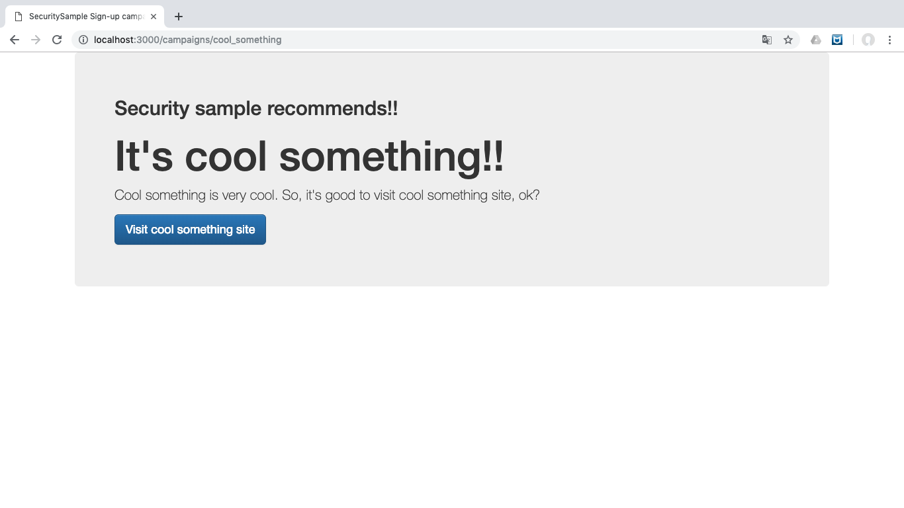
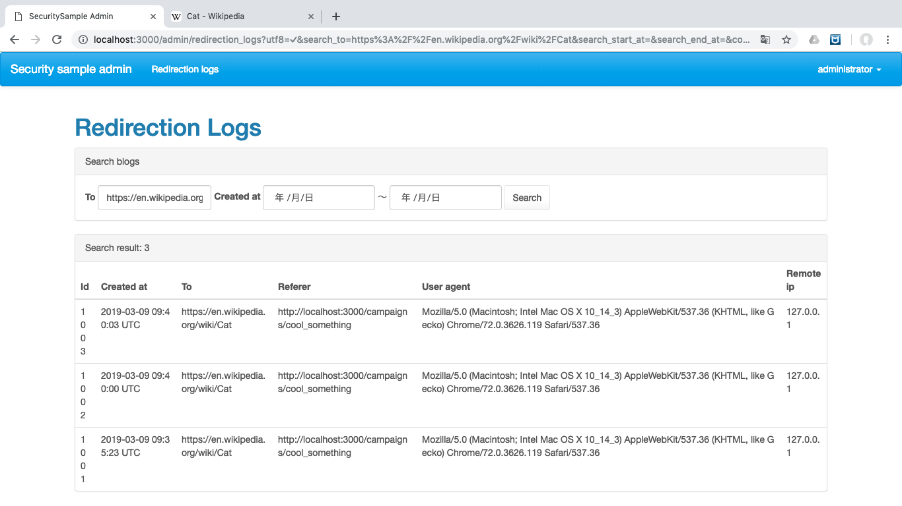
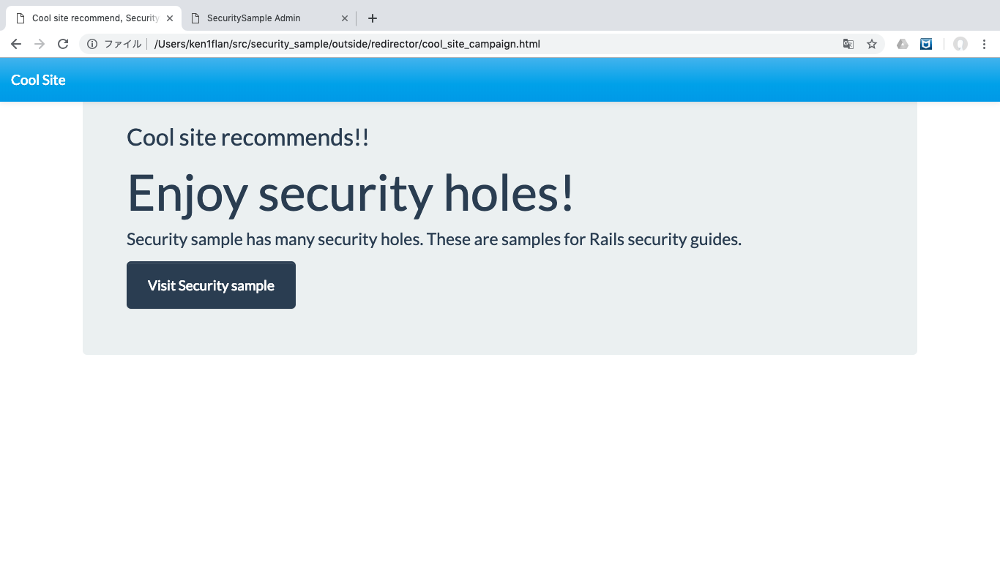
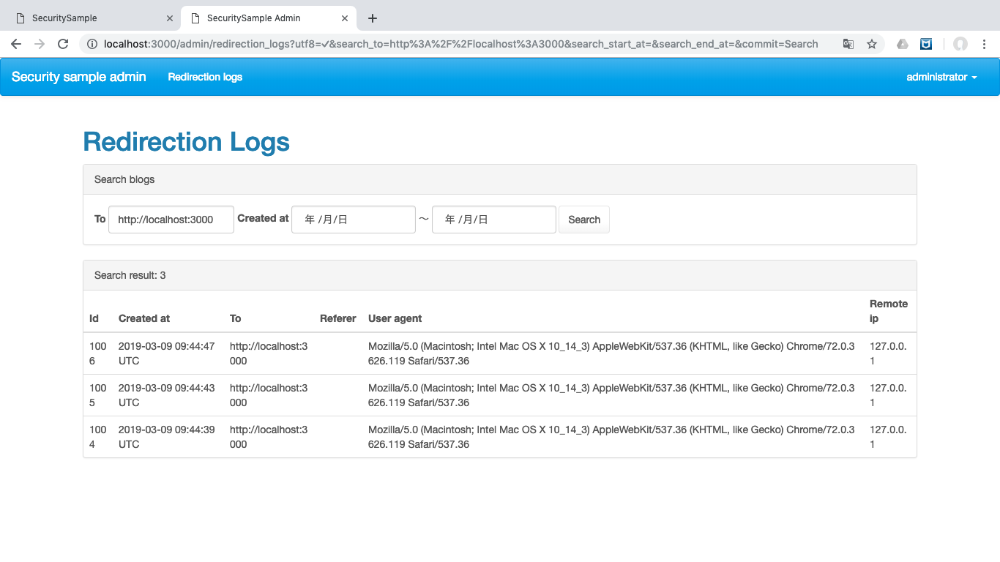

# リダイレクターのスキでヤラれる


ここでは、リダイレクターがどのようなものであるか、そのリダイレクターが悪用されるとどうなるのか、最後に悪用されないリダイレクターについて考えます。

## リダイレクターとは？

あるURLにアクセスすると、他のURLへジャンプさせる機能です。
ジャンプさせるためにサーバ側で処理を入れるので、その間でいろいろなことができます。
例えば、リダイレクトさせたときに回数を数えたり、リクエストの情報を保存したりします。

内部ではいろいろしていますが、ユーザはただURLが変わっただけにしか見えません。

それでは実際に試してみましょう。

### その1 クライアントへの誘導数をカウントする

このアプリケーションには、クライアントから請け負ったキャンペーンのページがあります。

http://localhost:3000/campaigns/cool_something

このページにある `Visit cool something site` ボタンをクリックすると、英語版WikipediaのCatの項目にジャンプします。



リダイレクトした数を確認するための管理ページで、その成果を確認することができます。

http://localhost:3000/admin/redirection_logs

検索フォームの`To`にリダイレクト先のURLを入れて`Search`を押してください。
先程のアクセスが見れると思います。

これで、クライアントにこのサービスから誘導した数を報告することができますね。



### その2 クライアントからの誘導数をカウントする

外部の提携先に依頼してキャンペーンページを作ってもらい、そこからこのアプリケーションに誘導してもらいます。
外部の提携先のキャンペーンページのつもりで、 `outside/redirector/cool_site_campaign.html`という名前のファイルをブラウザで開いてください。

このページにある `Visit secuiry sample` をクリックすると、このアプリケーションのトップページにジャンプします。





### リダイレクタの設定方法

このアプリケーションのリダイレクターは利用方法が簡単です。
リダイレクターのURLの後ろにパラメータ`to`に飛び先のURLを設定するだけです。
誰にも断らずに自由に使えるので、運用負荷がとても軽いです。

```plain
http://localhost:3000/redirector?to=(飛び先のURL)
```

### 実装

実装はシンプルです。
リクエストの内容を記録した後、パラメータ`to`に設定されたURLにリダイレクトしているだけです。

```ruby
# app/controllers/redirectors_controller.rb
class RedirectorsController < ApplicationController
  def show
    RedirectionLog.write(request)
    redirect_to params[:to]
  end
end
```

```ruby
# app/models/rediretion_log.rb
class RedirectionLog < ApplicationRecord
  def self.write(request)
    create(
      to: request.params[:to],
      referer: request.referer,
      remote_ip: request.remote_ip,
      user_agent: request.user_agent,
    )
  end
end
```

## オープンリダイレクター

誰でもどこからでも使えるリダイレクターは大変便利そうですが…。
誰でもということは、よからぬことを企む、アイデア豊かな人も使えるということです。
よくある手口を試してみましょう。

### その1 フィッシングサイト

サンプルアプリケーションを真似た、フィッシングサイトが作られたとします。
フィッシングサイトと思いながら次のファイルをブラウザで開いてください。

`outside/redirector/spam_site_campaign.html`

サインアップやログインがリンクを確認すると、パッと見はサンプルアプリケーションのURLですが、もっとよく見ると、別のサイトへのリンクになっています。
リンクの上にマウスを乗せてURLを見てからクリックする用心深い人も、間違えてしまいそうです。


### その2 詐欺メール

サンプルアプリケーションの運営っぽいひとから届いたメールと思って、次のテキストを読んでください。

```plain
From: セキュリティサンプル事務局緊急連絡係 <emergency@security-sample-organizer.evil.example.com>
Subject: 【緊急】あなたのアカウントが乗っ取られている可能性があります！！
Body:
いつもご利用いただき、誠にありがとうございます。
セキュリティサンプル事務局緊急連絡係 佐藤と申します。

弊社ではサーバのログを定期的にチェックしております。
その中であなたのアカウントが、通常と異なる場所から普段と異なる操作を行っていたことを検知致しました。

つきましては、下記リンクよりセキュリティサンプルに今すぐログインいただき、
パスワードの変更をお願い致します。

http://localhost:3000/redirector?to=https://en.wikipedia.org/wiki/Spam_(food)

ご不明な点がございましたら、お問い合わせください。
お手数をおかけいたしますが、よろしくお願い致します。

--
セキュリティサンプル事務局緊急連絡係
佐藤 某
```

メールの本文中にリンクが書かれていますが、サンプルアプリケーションのURLではじまっています。最後までキッチリ読む用心深い人以外はあっさり信じてしまいそうです。

## 修正案

不正利用を防ぐには、登録制にするのが一番です。遷移先を登録できるようにアプリケーションを改修したり、bitlyなどの外部サービスを利用するのもよさそうです。
