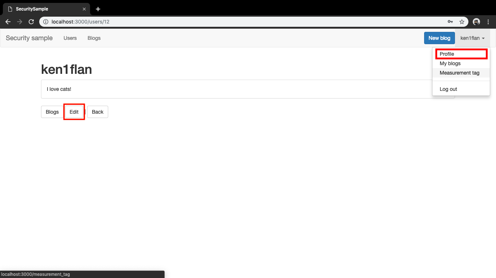
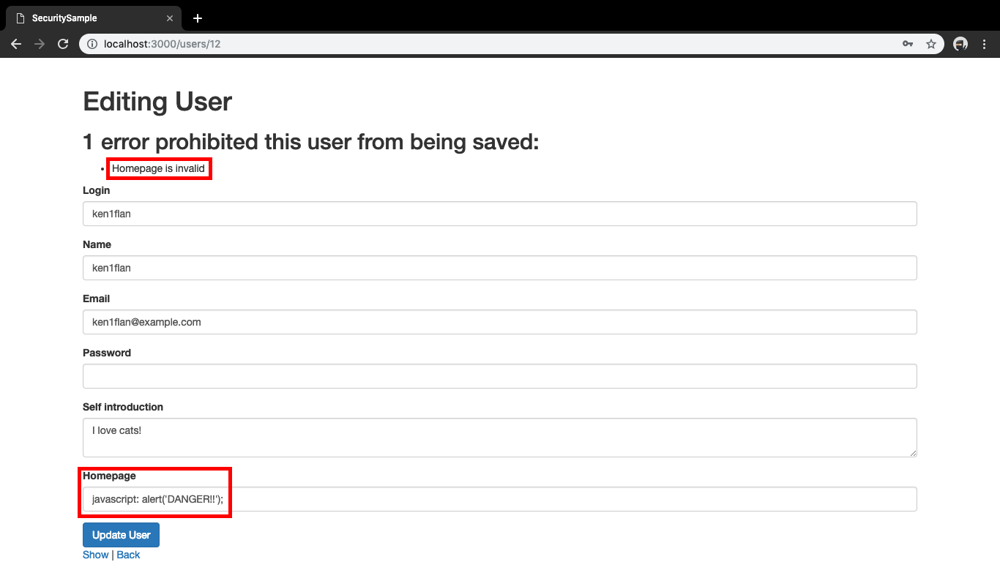
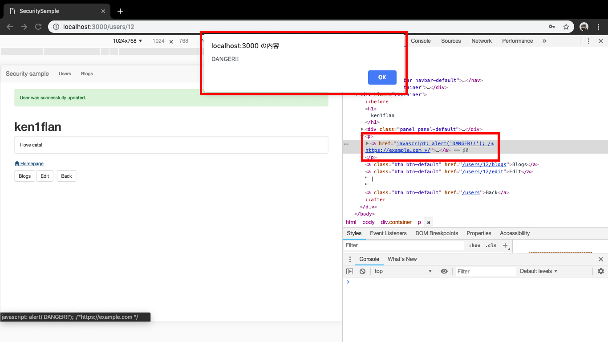

# 正規表現

ここでは趣向を変えて、攻撃者になってみます。
ログインされた状態で、右上のアカウント名のドロップダウンメニューから、`Profile`をクリックすると、プロフィールが表示されます。



`Edit`ボタンで編集ができます。
ここで`Homepage`の項目にJavascriptを設置してみましょう。
`Homepage`は`<a>`タグとして設置されるので、`javascript: alert('DANGER!!')`のように設定する必要があります。

直接入れてもうまくいきません。
この値は検証されているので、`http://〜`や`https://〜`のような値でないと入りません。



複数行にして、一行目はJavascript、2行目の行頭が`http://`で始まるようにしたらどうでしょう？
この編集ページのフォームは`<input type='text'>`ですが、複数行入れることは可能です。例えば、プロフィール編集画面のHTMLを開発者ツールなど`<input type="text" 〜>`を`<textarea>`に変えられます。


そうした上で、後述のデータを入力して保存してみてください。
1行目文末でコメントにし、その後コメントとして2行目にURLが記載されています。

```javascript
javascript: alert('DANGER!!'); /*
https://example.com */
```

保存後、`Homepage`リンクをクリックしてみてください。`alert`が表示されたかと思います。



## どうなっているのでしょう？

検証部分がおかしいので、modelを確認します。
`homepage`の`format`の設定を見ると正規表現で書かれています。
`/^https?:\/\/.*$/`は`http://`か`https://`で始まる…と書かれています。一見よさそうですが、先頭と末尾を表すのに`^`と`$`を使っています。

```ruby
# app/models/user.rb
class User < ApplicationRecord
    :
    :
  validates :homepage, format: { with: /^https?:\/\/.*$/, multiline: true }, allow_blank: true
end
```

Rubyでは`^`は行の先頭、`$`は行末を表します。ですので、複数行の入力に対してこのパターンを使うと、マッチしてしまいます。

```ruby
"javascript: alert('DANGER!'); /*
http://example.com
*/".match?(/^https?:\/\/.*$/)
# => true
```

Rubyの正規表現には文字列の先頭、末尾を表す`\A`と`\Z`があります。これらを使えば複数行でも正しく判定できます。

```ruby
"javascript: alert('DANGER!'); /*
http://example.com
*/".match?(/\Ahttps?:\/\/.*\Z/)
# => false
```

## 修正案

ここの機能で、ホームページのURLであることの検証であるならば、`\A`と`\Z`に変えることが妥当でしょう。

```ruby
# app/models/user.rb
class User < ApplicationRecord
    :
    :
  validates :homepage, format: { with: /\Ahttps?:\/\/.*\Z/ }, allow_blank: true
end
```
