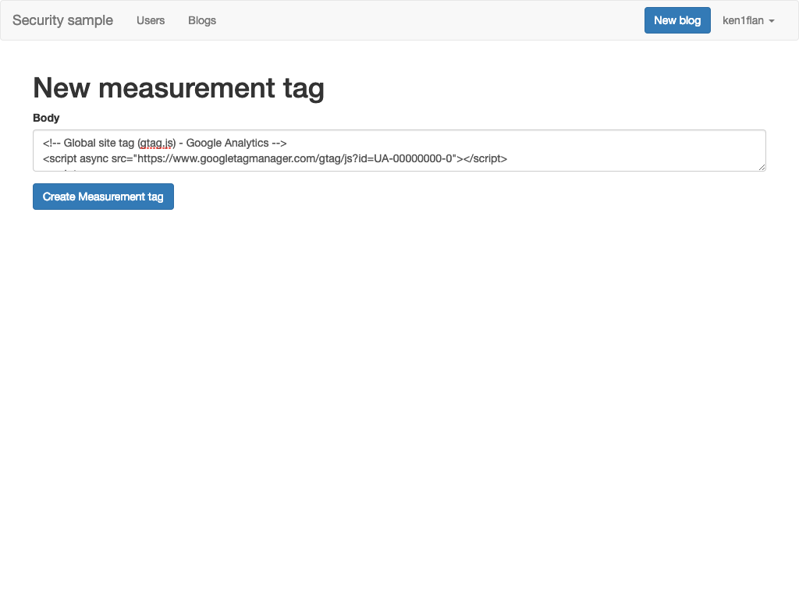
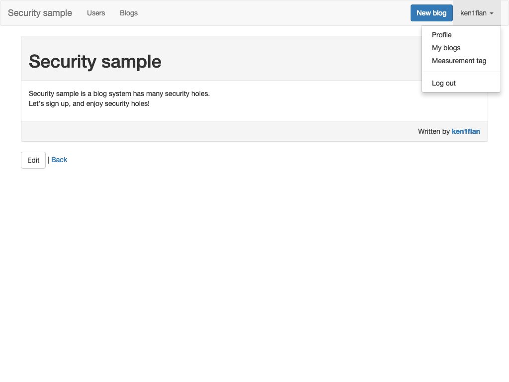
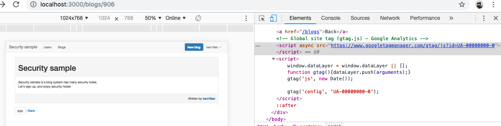
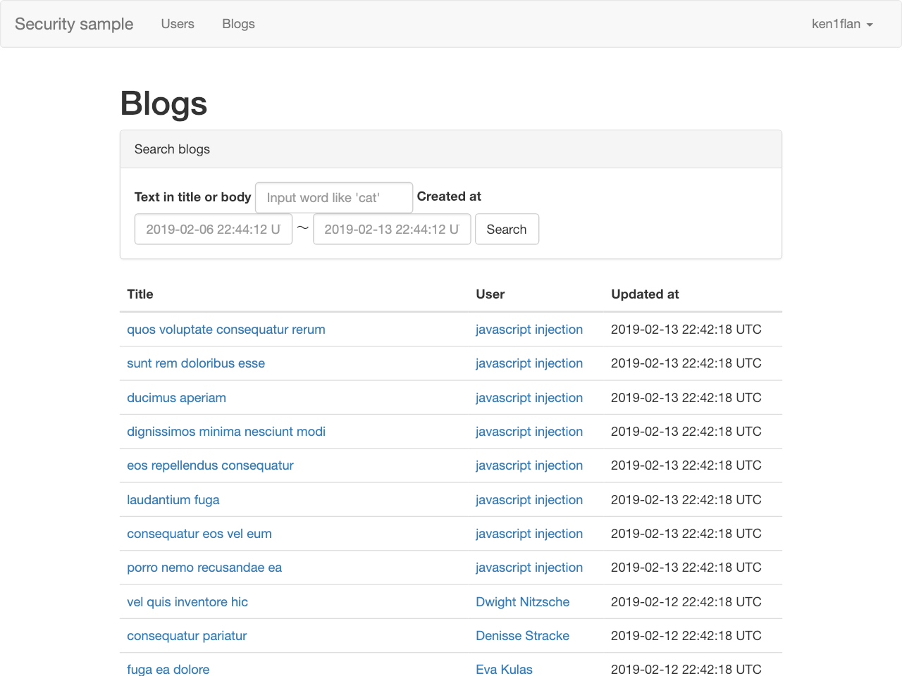
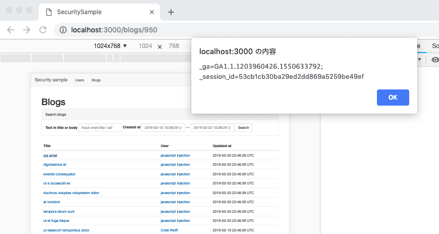

# クロスサイトスクリプティング


## ユーザに好きな計測タグを

### タグの登録
このアプリケーションは登録したユーザがブログをするためのものです。
ブログを公開したら、当然、どれくらい見られたのか気になることでしょう。
ですので、ユーザがGoogle Analyticsなどのタグを設置できるようになっています。

ログインした状態でユーザ名をクリックすると、ドロップダウンリストが表示されます。
その中にある`Meadurement tag`というリンクをクリックすると、計測タグの編集画面が表示されます。



ここでタグを記入して保存すると、ブログの各ページに貼られます。

### ブログ
準備のところで書いたブログをみましょう。
画面右上のアカウント名のドロップダウンをクリックし、`My blogs`のリンクから辿ると早いです。



Chromeの開発者ツールなどでソースを見てみると、先程入れたタグがページに埋め込まれていることが確認できます。



これでGoogle Analyticsから、自分のブログがどれくらい見られているか確認できます。便利ですね。

## 被害にあってみよう

ブログ一覧から、`javascript injection`さんのブログを探して、開いてみてください。

http://localhost:3000/blogs



ブログを読むために詳細ページを開くと…。
セッションIDが表示されています。



Javascriptは自サイトのクッキーに自由にアクセスできるので、このようなこともできるのです。
これを表示などせずに、外部へこっそり送ったとしたらどうなるでしょうか…？

## どうなってるの？

原因は `app/views/blogs/show.html.erb` で `raw` を使って、計測タグを配置しているからです。
これによってエスケープされないテキストの描画をさせています。

```erb
<%= raw @blog.user.measurement_tag&.body %>
```

多くのユーザはおそらく計測タグを素直に入力すると思われますが、世の中にはごく少数ですが、こういったところに悪意のあるJavascriptを設置するひとがいます。


## 直し方
計測タグなどを入れたい場合には、サービス側で雛形を提供し、そこに埋め込む変数のみユーザに入力してもらうのがよさそうです。
