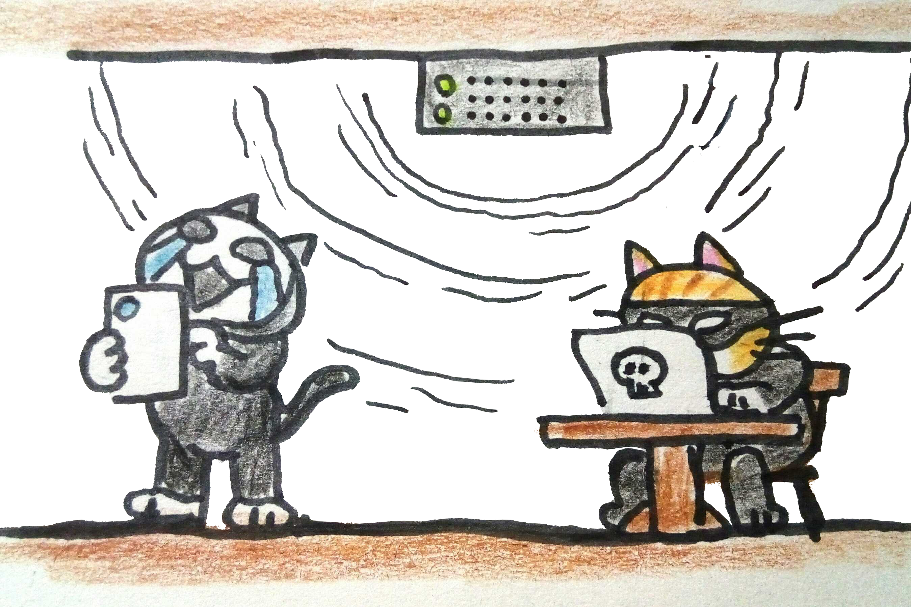
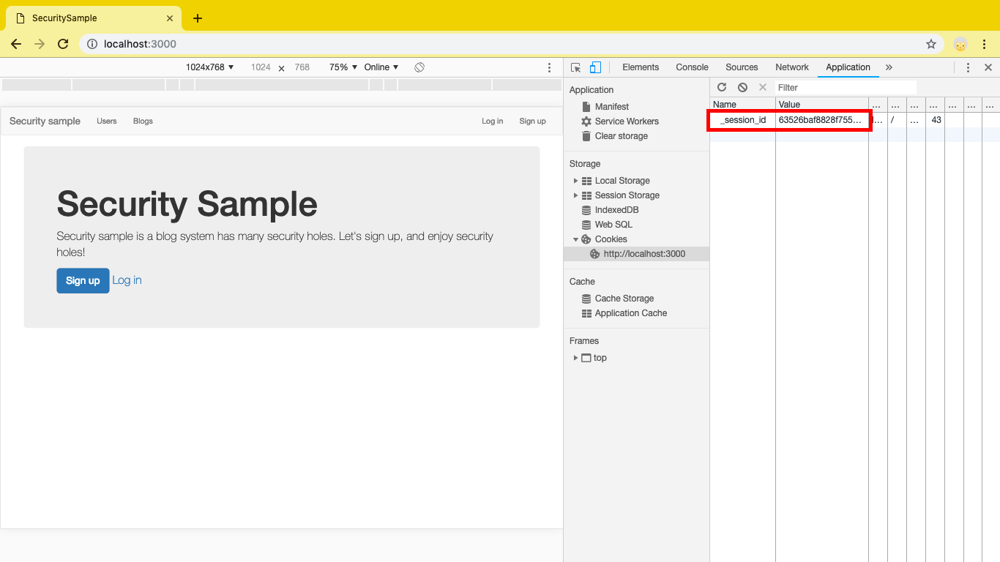
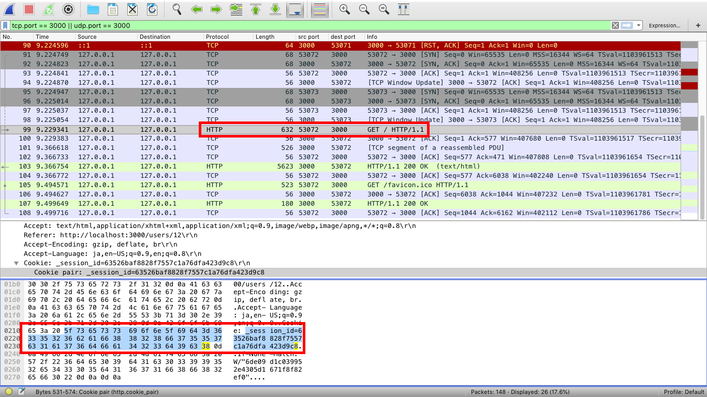
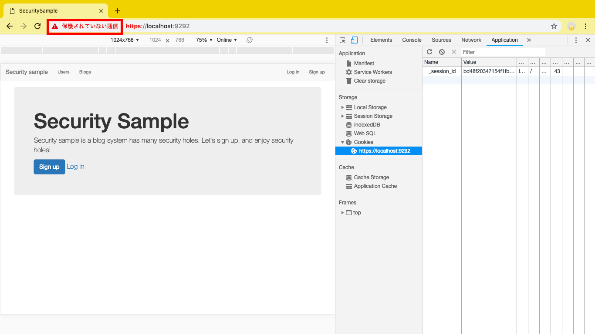
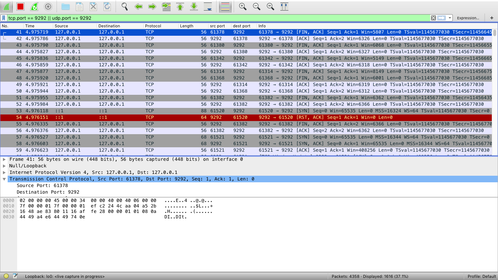

# HTTPとHTTPSのパケット

HTTPとHTTPSでサンプルアプリケーションにアクセスしたときに、パケットの内容が見れるのかどうかを確認します。

## お断り

筆者はパケットキャプチャツールとして、[WireShark](https://www.wireshark.org/)を使いました。
ですので、パケットキャプチャのスクリーンショットはWireSharkのものです。

## HTTP

パケットキャプチャで監視しながら、
https://localhost:3000 にアクセスしてみてください。

サンプルアプリケーションへのGET要求を見ると、セッションIDがそのまま見ることができます。

このように、HTTPの通信は暗号化されていないので、パケットを覗き見ることで、セッションハイジャックをするために必要なセッションIDを取得することも可能です。

## HTTPS

パケットキャプチャで監視しながら、
https://localhost:9292 にアクセスしてみてください。
自己署名証明書を使っていますので、警告が出ますが、localhostへのアクセスなので、無視してアクセスしてください。

通信内容を一通りみても、セッションIDどころか、どこのURLへのアクセスかもわかりません。
通信開始から終了まですべて暗号化されているためです。

これであれば、パケットを覗き見てセッションIDを奪うことはできなそうです。
