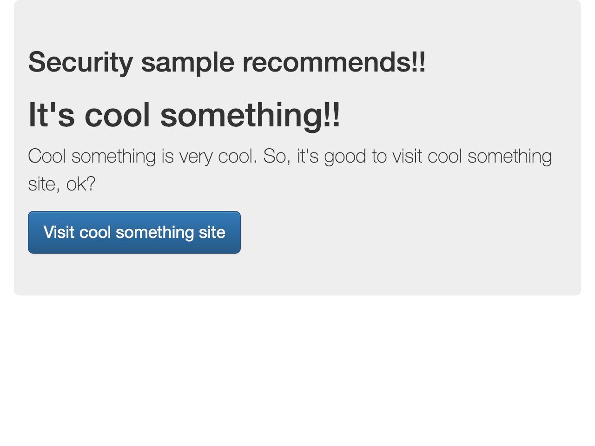
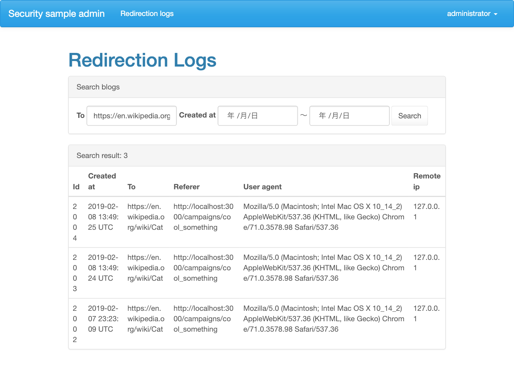
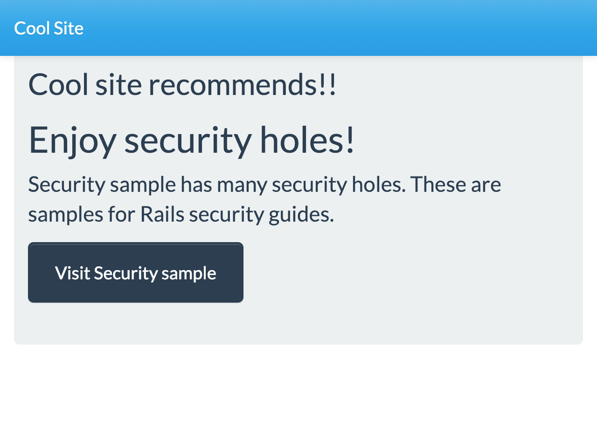
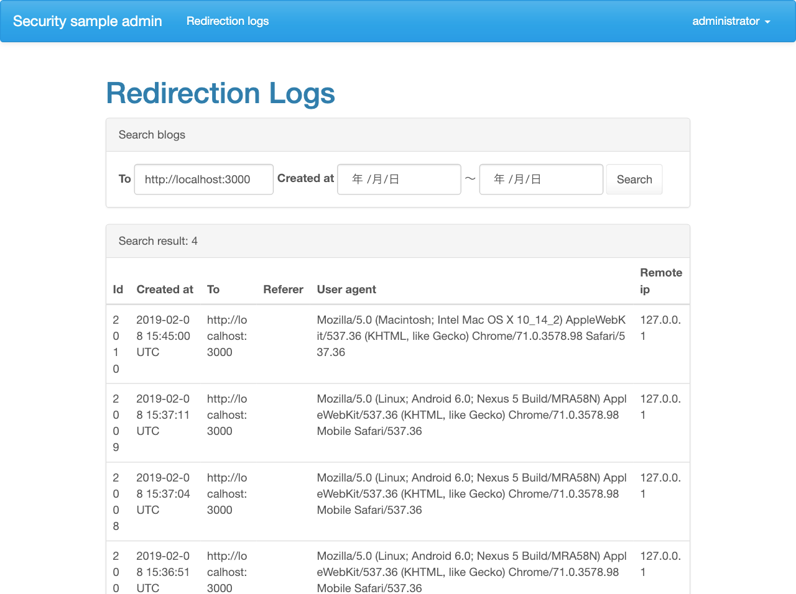

# オープンリダイレクタ

## リダイレクターとは？

あるURLにアクセスすると、他のURLへジャンプさせる機能です。
ジャンプさせるためにサーバ側で処理を入れるので、その間でいろいろなことができます。
例えば、リダイレクトさせたときに回数を数えたり、リクエストの情報を保存したりします。

内部ではいろいろしていますが、ユーザはただURLが変わっただけにしか見えません。

それでは実際に試してみましょう。

### その1 クライアントへの誘導数をカウントする

このアプリケーションには、クライアントから請け負ったキャンペーンのページがあります。

http://localhost:3000/campaigns/cool_something

このページにある `Visit cool something site` ボタンをクリックすると、英語版WikipediaのCatの項目にジャンプします。



リダイレクトした数を確認するための管理ページで、その成果を確認することができます。

http://localhost:3000/admin/redirection_logs

検索フォームの`To`にリダイレクト先のURLを入れて`Search`を押してください。
先程のアクセスが見れると思います。

これで、クライアントにこのサービスから誘導した数を報告することができますね。



### その2 クライアントからの誘導数をカウントする

外部の提携先に依頼してキャンペーンページを作ってもらい、そこからこのアプリケーションに誘導してもらいます。
外部の提携先のキャンペーンページのつもりで、 `outside/redirector/cool_site_campaign.html`という名前のファイルをブラウザで開いてください。

このページにある `Visit secuiry sample` をクリックすると、このアプリケーションのトップページにジャンプします。





### リダイレクタの設定方法
このアプリケーションのリダイレクターは利用方法が簡単です。
リダイレクターのURLの後ろにパラメータ`to`に飛び先のURLを設定するだけです。
誰にも断らずに自由に使えるので、運用負荷がとても軽いです。

```plain
http://localhost:3000/redirector?to=(飛び先のURL)
```

## オープンリダイレクタ脆弱性

誰でも誰にも断らずに使える…ということは、自分や同じ会社のひと以外が勝手に使えるということです。
想像しながら、実際に試してみましょう。

### その1 悪意のあるサイトで利用

悪意のある人が自身のページに、このリダイレクターを使ったリンクを設置して、悪意のあるサイトに誘導します。

### その2 悪意のあるメールで利用

### オープンリダイレクタとは？

このように、サイトの管理者以外のひとが自由にリダイレクト先を設定できることをいいます。
URLが一見このアプリケーション内のリンクに見えるので、フィッシングサイトやスパムメールで被害者を騙すことに使われる可能性があります。

## 直し方

